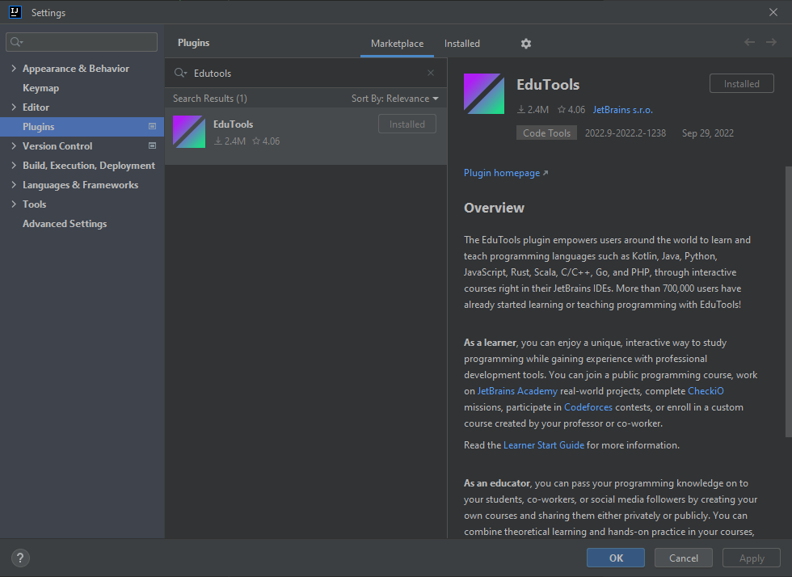
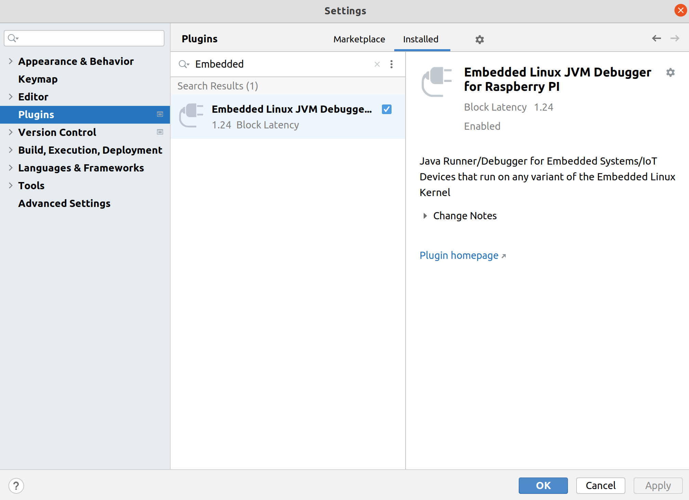
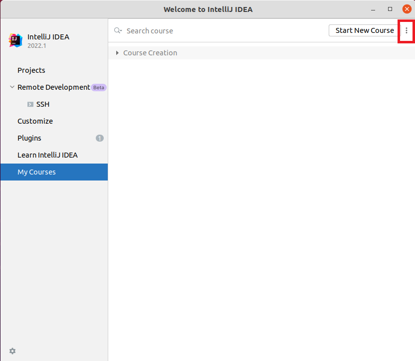
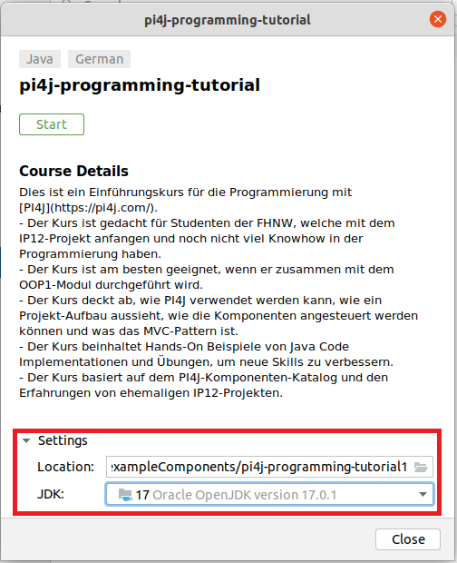
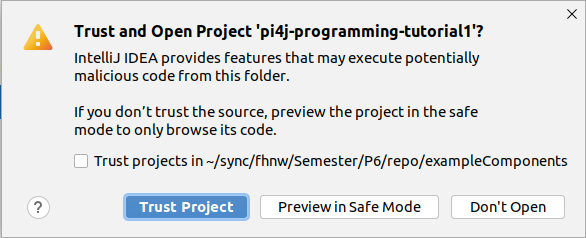
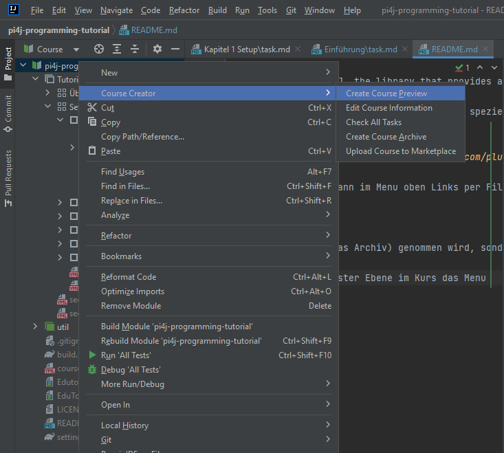

# Pi4J Programming Tutorial

Learn how to implement awesome Raspberry Pi projects based on Pi4J, the library that provides a friendly object-oriented API for Java Programmers to access the full I/O capabilities of the Raspberry Pi platform.

Dieses Repository ist ein deutscher Leitfaden und Tutorial, um in die Programmierung und speziell die API's der Java-Library PI4J einzuführen. Damit dieses Tutorial gestartet werden kann, muss in IntelliJ [JetBrains Academy](https://plugins.jetbrains.com/plugin/10081-jetbrains-academy) installiert werden.

## Installation

Wenn IntelliJ geöffnet ist, kann über die Webseite [JetBrains Academy](https://plugins.jetbrains.com/plugin/10081-jetbrains-academy) direkt das Plugin auf die IDE installiert werden.

Das Plugin kann auch direkt in der IDE installiert werden. Dazu kann im Menu oben Links per File -> Settings -> Plugins das Plugin installiert werden, so wie hier aufgezeigt:

Das zweite Plugin, welches installiert werden muss, ist das folgende [Embedded Linux JVM Debugger for Raspberry PI](https://plugins.jetbrains.com/plugin/18849-embedded-linux-jvm-debugger-for-raspberry-pi):

## Kurs starten von Kursdatei

Auf dem Welcome Screen von IntelliJ kann, bei *My Courses* über die drei Punkte, die Kursdatei geöffnet werden.

Bevor der Kurs mit dem *Start* Button gestartet werden kann, muss zuerst bei den Settings überprüft werden, dass mindestens JDK Version 17 ausgewählt ist.

Die Kursdatei als *Trust Project* öffnen

Der Kurs ist nun mit der Hautpseite geöffnet.

## Kurs aus diesem Projekt heraus starten

Dieses Kapitel muss nur beachtet werden, wenn nicht der fertige Kurs gestartet werden soll, sondern lediglich ein 'Preview' der vom aktuellen Stand dieses Projekts generiert wird.

Um den Kurs in Lernform zu starten, muss per Rechtsklick auf oberster Ebene im Kurs das Menu "Course Creator → Create Course Preview" ausgewählt werden.

Durch diese Aktion öffnet sich ein zweiter IntelliJ Editor, der das Tutorial in der Lernform beinhaltet. Hier bitte warten, bis Gradle das Projekt fertiggestellt hat.
