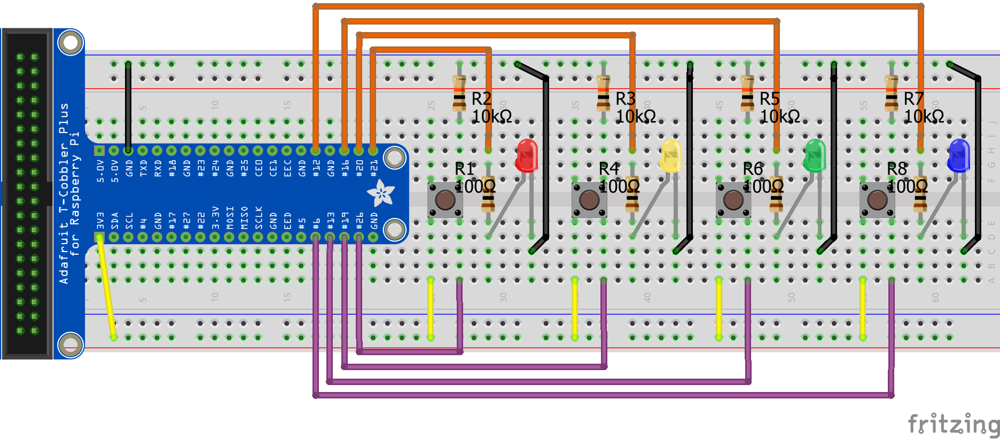
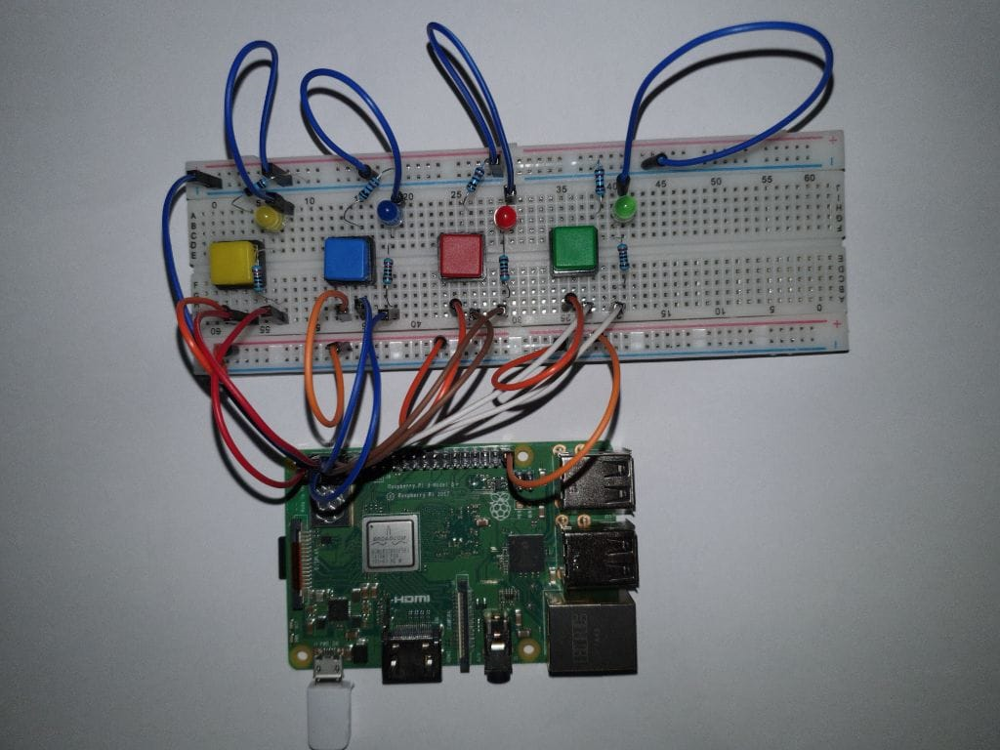

# Task 7/9: Kompontenten
In dieser Aufgabe geht es darum, die Komponenten in der eigenen Applikation zu deklarieren und implementieren. Das Model 
und der Kontroller sind bereits in den vorherigen Tasks umgesetzt.

---
> **_Hinweis:_**
>
> Im Explorer sind alle Klassen bereits sichtbar, die im Verlaufe der nächsten Tasks für eine mögliche Lösung notwendig
> sind.
---

## Aufgabe
Die Komponenten des eigenen Projektes sollen umgesetzt werden. Dieser Task erbt die Änderungen des Models und des Kontrollers
der vorherigen Tasks.

### Programmierung
- Implementiere die Hardware Komponenten im PUI.
- Stelle die Verbindung mit dem Model und dem Kontroller sicher.

---
> **_Hinweise:_**
> Im Code wird eine mögliche Lösung behandelt. Dies bedeutet nicht, dass diese Lösung unbedingt umgesetzt werden muss.
---

### Check Programmierung
Die Programmierung lässt sich mit dem Button *Check* überprüfen. Nach erfolgreich abgeschlossenem Test kann mit der
Erstellung der Hardware begonnen werden. Ist der Test nicht erfolgreich, muss zuerst der Fehler behoben werden. Dabei können
allfällige Hints oder ein Blick in die Lösung helfen.

### Aufbau
Als Nächstes muss die gewählte Hardware mit dem Raspberry Pi richtig verbunden werden. Die Musterlösung mit 4 *LEDButtons* 
könnte wie folgt aussehen:

### Remote Ausführung
Die Applikation ist nun bereit, um auf dem Pi ausgeführt zu werden. Dazu ist eine
Running-Config *EigenesProjekt-Komponenten* hinterlegt.