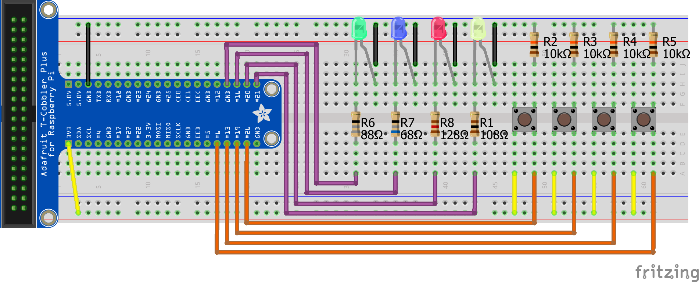

# Task 4/10: Schema
Hier wird ein Beispielsschema für die vorhin genannte Applikation aufgezeigt. Leider haben sich hier Fehler eingeschlichen.
Markiere alle Aussagen, die stimmen in Bezug auf die vorhin genannte Applikation.

