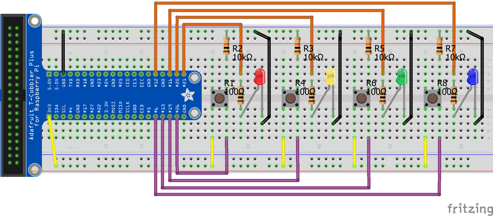
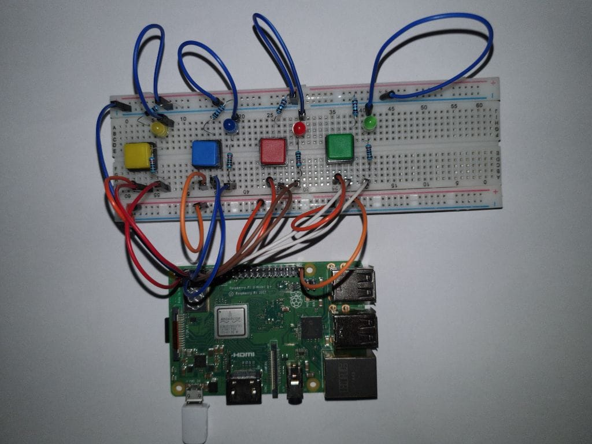

# Task 5/7: SimonSays
In dieser Aufgabe geht es darum, ein eigenes Simon Says zu erstellen. Die wichtigsten Funktionen der Applikation sind hier 
nochmals kurz erwähnt:
- Start der Applikation durch einen Button
- Simon gibt eine Farbfolge vor und der Spieler muss diese wiedergeben können
- Wird eine Farbfolge erfolgreich wiedergegeben, ist die nächste Farbfolge um eine Farbe länger
- Bei einem Fehler wird das Spiel beendet, mit einem Taster kann danach ein neues Spiel gestartet werden

## Model
In einem ersten Schritt geht es darum, im Model die benötigten Variablen zu definieren.

Als Hilfestellung sind alle Variablen aufgelistet, welche in der Musterlösung verwendet werden.

 <I>ledsGlowing</I> vom Typ BooleanArray -> Zustand der LEDs 
 <I>message</I> vom Typ String -> String um Mitteilungen an den Spieler über die Kommandozeile oder ein Display auszugeben 

## Kontroller
Als Nächstes müssen im Kontroller sämtliche Methoden erstellt werden, welche benötigt werden, um das Modell zu aktualisieren.

Ein möglicher Lösungsansatz ist es das Spiel in zwei Teile, Sequenz zeigen und Sequenz abfragen, zu unterteilen. 

Um dies zu erreichen, werden auch Variablen benötigt, welche nicht von der View dargestellt werden. Diese können direkt 
im Kontroller erfasst werden.

<pre style="background-color: #eee;border: 1px solid #999;display: block;padding: 2px;">
//possible variables
private Integer level = 0;
private Integer startNumberOfLed = 4;
private ArrayList<> sequence = new ArrayList<>(List.of(0,1,2,3,0,0,0,0,0,0));
private Integer numberOfPressedLed = 0;
</pre>

### Sequenz zeigen
Zuerst soll eine zufällige Sequenz generiert werden.

<pre style="background-color: #eee;border: 1px solid #999;display: block;padding: 2px;">
//create random sequence
for (int i = 0; i < get(model.sequence).size(); i++){
    Random random = new Random();
    get(model.sequence).set(i, random.nextInt(4));
}</pre>

Danach sollen die LED entsprechend ein und ausgeschalten werden.

    <pre style="background-color: #eee;border: 1px solid #999;display: block;padding: 2px;">
for (int i = 0; i < (startNumberOfLed+level-1); i++){
    int currentLed = get(model.sequence).get(i);
    setValue(model.led0IsGlowing,true);
    sleep(1000);
    setValue(model.led0IsGlowing,false);
    sleep(500);
}</pre>

### Sequenz abfragen
Bei jedem Button der gedrückt wird, muss natürlich kontrolliert werden, ob die Sequenz noch stimmt. Doch es müssen noch weitere
Fragen geklärt werden:
- ist das nächste Level erreicht
- ist das Spiel beendet

Überprüfe, ob die richtige Sequenz eingehalten wird

<pre style="background-color: #eee;border: 1px solid #999;display: block;padding: 2px;">
//check if right button is pressed
if(btnNumber == sequence.get(numberOfPressedLed)){
    increase(model.numberOfPressedLed);
    sleep(100);
    setValue(model.message, "Your " + numberOfPressedLed +" button was button number "+ btnNumber + ". This was right.");
}else{
    setValue(model.message, "You pressed the wrong button. press any button to restart the game");
    level = 0;
    return;
}</pre>

Überprüfe, ob das Level oder das Spiel beendet ist

<pre style="background-color: #eee;border: 1px solid #999;display: block;padding: 2px;">
//check if level is completed
if(numberOfPressedLed >= startNumberOfLed+level-1){
    setValue(model.message, "You have completed level" + level);
    level++;
    //check if game is completed
    if(level+startNumberOfLed > sequence.size()){
        setValue(model.message, "You have finished the game, press any button to restart the game");
        level=0;
        return;
    }
    numberOfPressedLed = 0;
    showNewSequence();
}
</pre>

## View
In der View geht es nun noch darum die LED Buttons richtig zu implementieren. Dies wurde bereits in den vorangehenden 
Aufgaben ausreichend besprochen.

Hier ist nochmals eine Hilfsstellung für die ModelToUIBindigns

<pre style="background-color: #eee;border: 1px solid #999;display: block;padding: 2px;">
onChangeOf(model.ledsGlowing).execute(((oldValue, newValue) -> {
    for (int i = 0; i < ledButtons.length; i++) {
        ledButtons[i].ledSetState(newValue[i]);
    }
}));

onChangeOf(model.message).execute(((oldValue, newValue) -> System.out.println(newValue)));
</pre>

### Check Programmierung
Die Programmierung lässt sich mit dem Button *Check* überprüfen. Nach erfolgreich abgeschlossenem Test kann mit der
Erstellung der Hardware begonnen werden. Ist der Test nicht erfolgreich, muss zuerst der Fehler behoben werden. Dabei können
allfällige Hints oder ein Blick in die Lösung helfen.

### Aufbau
Als Nächstes muss die gewählte Hardware mit dem Raspberry Pi richtig verbunden werden. Die Musterlösung mit 4 *LEDButtons*
könnte wie folgt aussehen:

### Remote Ausführung
Die Applikation ist nun bereit, um auf dem Pi ausgeführt zu werden. Dazu ist eine
Running-Config *EigenesProjekt-Komponenten* hinterlegt.