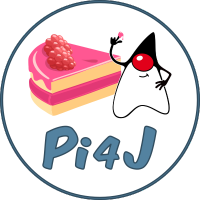

# Leitfaden zu Pi4J Anwendungen

Der vorliegende Leitfaden soll in die Thematiken von Pi4J, dem Hardware-Katalog, dem MVC-Pattern sowie dem Template-Projekt für Pi4J einführen. 

Der Leitfaden besteht aus den folgenden Lektionen:
- *Einführung*: Allgemeine Beschreibung über den Umgang und die Verwendung des Leitfadens.
- *Setup*: Testen ob Intellij richtig eingerichtet ist und ob die Kommunikation zwischen Raspberry Pi und Computer funktioniert.
- *Erste Komponente*: Erste Java-Komponenten aus dem Hardwarekatalog nehmen und diese in eine kleine Applikation einbinden.
- *Klassenmodifizierung*: Eine Java-Komponente aus dem Hardwarekatalog dient als Vorlage für eine neue Komponente.
- *Pi4J Umgebung*: Einführung in das Pi4J Framework.
- *Model View Controller*: Einführung in das MVC Pattern.
- *Eigenes Projekt*: Mit dem Erlernten aus den vorangehenden Lektionen eine eigene Applikation erstellen.

**Viel Spass beim Lernen und Basteln.**

Klick auf den Button *Next* um mit dem Tutorial zu starten.
