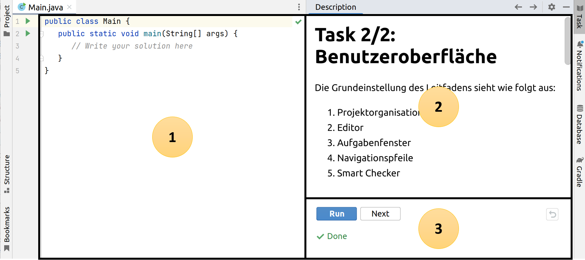

# Task 2/10: Benutzeroberfläche
Die Grundeinstellung des Leitfadens sieht wie folgt aus:

1. Editor
2. Aufgabenfenster
3. Navigationspfeile
4. Smart Checker

## Editor
Der Leitfaden beinhaltet diverse praktische Programmieraufgaben, welche im Editor direkt gelöst werden können.

## Aufgabenfenster
Im Aufgabenfenster wird, je nach Aufgabe, die Theorie zur Lektion vermittelt, Multiple-Choice-Fragen zur Lektion gestellt
oder praktische Aufgaben gestellt, welche im Editor gelöst werden müssen.

## Navigationspfeile
Mit den Navigationspfeilen kann zwischen den einzelnen Tasks einer Lektion hin und her gesprungen werden.

## Smart Checker
Mit dem Smart Checker kann die Lösung überprüft und zum nächsten Task in der Lektion gesprungen werden. 

Mit dem Button *Next* zum nächsten Task wechseln.