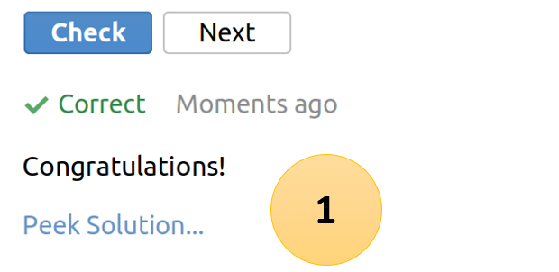

Der **Educational Task** ist ein Task, um Programmieraufgaben zu lösen. Jeder Task hat ein Main.java File mit unterschiedlichen
Aufgaben. Mit Placeholder ist ersichtlich, welche Aufgabe an welcher Stelle im Code gelöst werden muss.
Im Aufgabenfenster sind alle wichtigen Informationen zu den Aufgaben vorhanden.

Im *Smart Checker* gibt es neben dem bekannte *Next* Button ein Button *Check*. Mit diesem Button lässt sich der erstellte 
Code überprüfen.

Nachdem ein Check durchgeführt wurde, kann mit Peak Solution (1) die Musterlösung betrachtet werden.

## Aufgabe
Gib den Text *Hello world, hello Leitfaden* auf der Konsole aus. Benutze dazu den String *text* und *System.out.Println()*.

Überprüfe mit *Check* den Code. Wenn dieser richtig funktioniert mit dem Button *Next* zur nächsten Lektion gehen.