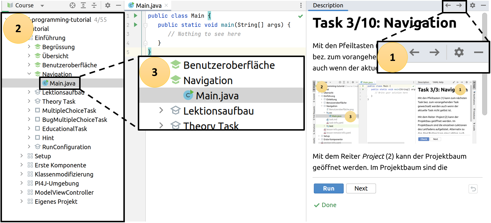

Mit den Pfeiltasten (1) kann zum nächsten Task bez. zum vorangehenden Task gewechselt werden, auch wenn der aktuelle Task
nicht gelöst ist.

Mit dem Reiter *Project* (2) kann der Projektbaum geöffnet werden. Im Projektbaum sind die einzelnen Lektionen des Leitfadens
aufgelistet. Alternativ zu den *Next* Button kann eine Lektion auch über den Projektbaum gestartet werden. Dazu einfach
die Klasse *Main.java* (3) des entsprechenden Tasks im Editor öffnen.

Mit dem Button *Next* zum nächsten Task wechseln.