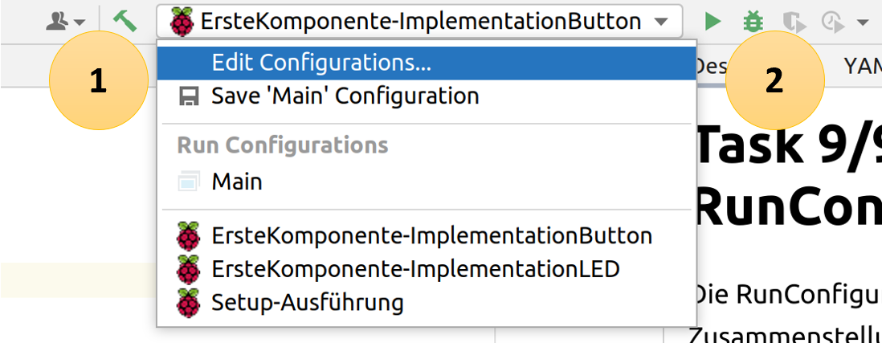
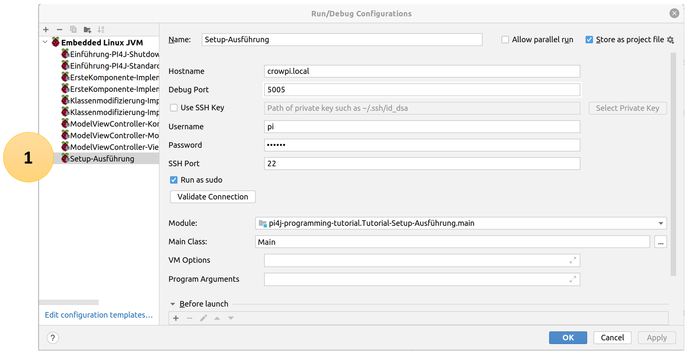

# Task 9/9: RunConfiguration
Die RunConfiguration ist eine Zusammenstellung von verschiedenen Befehlen, um eine ausgewählte Applikation auszuführen.

Im Fall des Leitfadens wird die RunConfiguration benutzt, um die Applikation zu übersetzen, auf dem Raspberry Pi
bereitzustellen und auszuführen.

## Auswählen der RunConfiguration
Um die Applikation auf dem Raspberry Pi auszuführen, muss die entsprechende RunConfiguration im Drop Down Menü (1)
ausgewählt und danach mit dem grünen Pfeil (2) gestartet werden.

## Anpassen der RunConfiguration
Muss eine Konfiguration angepasst werden, weil zum Beispiel die IP Adresse gewechselt werden muss, kann im Drop Down Menü
*Edit Configuration* angewählt werden

Es öffnet sich ein neues Fenster. Zuerst links im Fenster die entsprechende RunConfiguration auswählen. Danach lassen sich
die gewünschten Parameter editieren. Zum Beispiel kann anstelle des Hostname eine IP Adresse vergeben werden.

Es kann mit dem Button *Next* zur nächsten Lektion gewechselt werden.