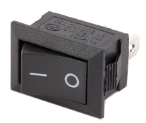

# Task 4/8: Implementation Klassenmodifizierung
In dieser Aufgabe ausgehend von der vorhandenen Klasse [SimpleButton](https://pi4j.com/examples/components/simplebutton/)
(aus dem Hardwarekatalog) eine neue Klasse `Switch` erstellt, damit Komponenten wie diese komfortabel in das Pi4J-Projekt integriert werden können.

- Ein Taster (Button) hat die Zustände *Gedrückt*, *Nicht-Gedrückt* und *Anhaltend-Gedrückt*. 

- Ein Schalter (Switch) hat jedoch nur noch zwei Zustände: *Eingeschaltet* und *Ausgeschaltet*. 

---
> **_Hinweis:_**
>
> Die Klasse `SimpleButton` wurde bereits aus dem Hardwarekatalog kopiert und
> in den Ordner `src` eingefügt.
---

## Aufgabe
Erstelle die Klasse `Switch` und teste diese auf dem Raspberry Pi und in einem JUnit-Testcase.

### Programmierung
- Kopiere den Inhalt der Klasse `SimpleButton` in die Klasse `Switch`
- Lösche alle Kommentare
- Lösche alle Attribute und Methoden, die etwas mit `WhilePressed` zu tun haben
- Deklariere, Initialisiere und registriere Funktionen für den Switch
- verwende für einen Switch sinnvolle Namen für die Attribute und Methoden
- Schreibe neue, für einen Switch passende Kommentare 
- vervollständige den TestCase `SwitchTest` und starte ihn auf deiner Entwickler-Maschine

---
> **_Hinweis:_**
> Die Aufgabe soll in den Klassen `Main` und `Switch` gelöst werden. Vergiss nicht, die Konstruktoren sollten nicht mehr `SimpleButton`,
> sondern `Switch` heissen. Auch im Konstruktor hat es noch `WhilePressed` Referenzen.
---

Die Main.java könnte wie folgt aussehen:
<pre style="background-color: #eee;border: 1px solid #999;display: block;padding: 2px;">
// Run the application
System.out.println("Application is running");

// Create a new Switch component
Switch obj = new Switch(pi4j, PIN.D26, false);

// Register functions to the States of the switch
obj.onSwitchOn(() -> System.out.println("XXX"));
obj.onSwitchOff(() -> System.out.println("YYY"));

// Running the App for 15 Seconds
sleep(15000);

// DeRegistering functions before shutting down
obj.reset();

// End of application
System.out.println("Application is done");
</pre>

### Check Programmierung
Die Programmierung lässt sich mit dem Button *Check* überprüfen. Nach erfolgreich abgeschlossenem Test kann mit der 
Erstellung der Hardware begonnen werden. Ist der Test nicht erfolgreich, muss zuerst der Fehler behoben werden. Dabei können
allfällige Hints oder ein Blick in die Lösung helfen. 

### Aufbau
Als Nächstes muss der Switch mit dem Raspberry Pi richtig verbunden werden. Das elektrische Layout von 
[SimpleButton](https://pi4j.com/examples/components/simplebutton/) zeigt eine mögliche Lösung. 
Für den Testaufbau wird als Hardwarekomponente lediglich ein Schalter statt des Tasters verwendet.

### Remote Ausführung
Die Applikation ist nun bereit, um auf dem Pi ausgeführt zu werden. Dazu ist eine
Running-Config *Klassenmodifizierung-ImplementationKlassenmodifizierung* hinterlegt.