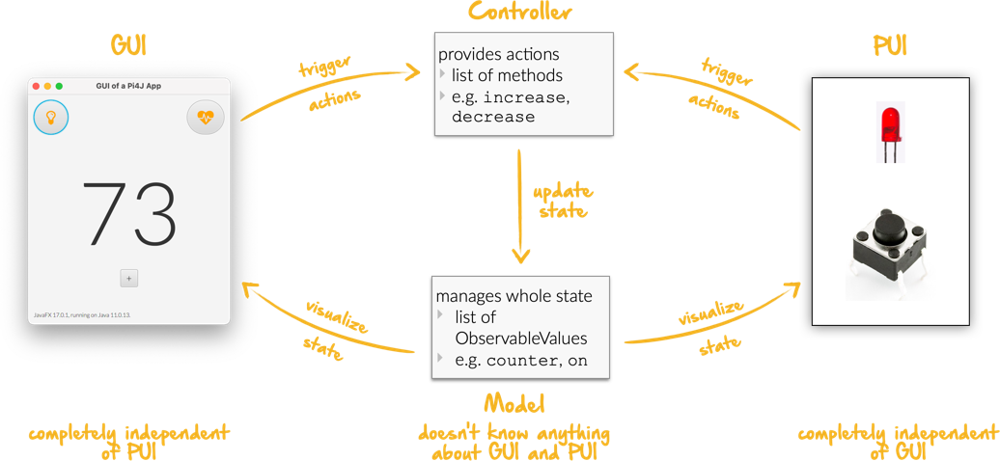

# Task 7/8: Zusammenfassung
Dieser Task beinhaltet eine kurze Zusammenfassung, was in dieser Lektion alles gelehrt wurde.

## MVC
Das MVC Pattern besteht aus dem Model, der View und dem Controller. Das Model speichert die Daten der Applikation, der 
Kontroller setzt auf Signale von PUI oder GUI änderungen im Model um, und die View ist zuständig für die 
Darstellung der Daten aus dem Model, sowie für die Bereitstellung von Interaktions-Möglichkeiten der Applikation.

## GUI und PUI
GUI steht für Graphical User Interface, währen PUI für Physical User Interface steht.
Das GUI besteht aus Grafischen Inhalten auf dem Bildschirm, das PUI können auch Komponenten direkt am Raspberry PI angehängt sein.

