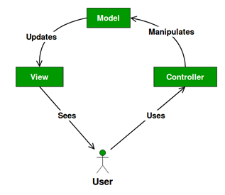

In den folgenden zwei Tasks wird die Applikation aus der vorangehenden Aufgabe nochmals 
schrittwiese erstellt. Als erstes wird der Button implementiert und danach die LED. 
Die Grundstruktur baut auf dem [Model View Controller](https://www.geeksforgeeks.org/mvc-design-pattern/) 
(MVC) Pattern auf. Dieses Pattern 
wird zu einem späteren Zeitpunkt nochmals detailliert erklärt. An dieser Stelle sollen 
nur kurz auf die grundlegenden Eigenschaften des Patterns eingegangen werden. Das MVC
Pattern wird normalerweise für Applikationen mit einer Benutzerschnittstellen verwendet 
und unterteilt das Programm in die folgenden drei Teile.

Im Model werden die Daten der Applikation gespeichert.

Die View macht die Daten sichtbar zum Beispiel in Form einer Tabelle oder 
eines Diagrammes. Es sind auch mehrere Ansichten derselben Information möglich.

Der Controller verarbeitet Signale von der View oder von anderen 
externen Quellen und ruft normalerweise eine Methode auf, um das Modell anzupassen.

Der Begriff Graphical User Interface (GUI) ist weit verbreitet und steht eine Schnittstelle 
zwischen Benutzer (User) und Applikation. LED und Buttons sind keine graphische, 
sondern physikalische Elemente. Darum wird an dieser Stelle der Begriff Physical 
User Interface (PUI) verwendet. Als Schnittstelle zum Benutzer sind im MVC Pattern 
beide Begriffe in der View angesiedelt.

# Aufgabe
In einem ersten Schritt soll nun der Button ausgelesen werden. Dazu soll in der Klasse 
SomePUI.java die folgenden Punkte umgesetzt werden:
1. Erstellen des Objektes button aus SimpleButton
2. Initialisierung des Objektes in der InitializeParts Methode
3. Wird der Button gedrückt, soll die Methode pressButton vom Controller einmal ausgeführt werden

Hint: Die Methode pressButoon ändert den Wert der Variable counter im Modell um eins. 
Diese Variable wird in der View überwacht. Ändert sich der Wert wird eine Meldung 
auf dem CLI ausgegeben.

# Check Programmierung
Überprüfe die Programmierung mit dem "Check" Button unten links. Ist der Test 
erfolgreich kannst du mit der Vorbereitung der Hardware beginnen. Ist der Test nicht 
erfolgreich versuche den Fehler zu beheben. Nutze dazu allfällige Hints oder schau in 
der Lösung nach.

# Aufbau
Als nächstes muss der Button mit dem Rapsberry Pi richtig verbunden werden. Nutze dazu die
Dokumentation [SimpleButton](https://pi4j.com/examples/components/simplebutton/) 
des Hardwarekataloges auf der Pi4J Webseite.

# Remote Ausführung
Die Applikation ist nun bereit, um auf dem Pi ausgeführt zu werden. Dazu ist eine 
Running-Config hinterlegt. Diese kann wie hier im Bild aufgezeigt ausgewählt werden:
