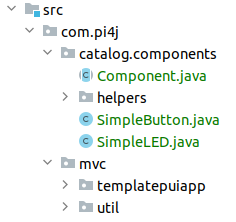

Für die Implementation der LED wurden im Programm die folgenden Änderungen vorgenommen:
- Das Modell wurde um die Variable *ledGlows* erweitert. Sie beschreibt den Zustand der Led, ob diese leuchtet oder nicht leuchtet.
- Im Controller wurden die beiden Methoden *ledOn* und *ledOff* ergänzt. Die Methode *ledOn* setzt den Zustand 
von *ledGlows* auf TRUE. *LedOff* ändert den Zustand von *ledGlows* auf FALSE. Zudem erhöht *ledOff* die Variable 
*counter* um eins und beendet die Applikation, wenn die Variable *counter* grösser als *terminationCount* ist. 
Desweiteren wurde die Methode *pressButoon* entfernt.
     
# Aufgabe
## Programmierung
Als nächstes soll die Klasse *SimpleLed* verwendet werden um eine LED anzusteuern. Dazu
soll die Klasse *SomePUI* um die folgenden Punkte geändert werden:
1. Erstellen des Objektes *led* aus *SimpleLED*
2. Initialisierung des Objektes in der *InitializeParts* Methode
3. Neu wird zusätzlich die Variable *ledGlows* überwacht. Hat die Variable den Zustand TRUE soll die LED leuchten. Hat die Variable den Zustand FALSE, soll die LED nicht leuchte. Verwende für die Ansteuerung der LED die Methoden von *SimpleLED*.

---
> **_Hinweis:_**
>
> Die Klasse *SimpleLED* wurde bereits aus dem Hardwarekatalog kopiert und
> in den Ordner src/com/pi4j/catalog/components eingefügt. Wenn das Projekt weitere Klassen
> aus dem Katalog benötigt, können diese in den gleichen Ordner kopiert werden. Allenfalls
> benötigte Hilfsklassen gehören in den Unterordner helpers.
>
> 
---

## Check Programmierung
Überprüfe die Programmierung mit dem *Check* Button unten links. Ist der Test erfolgreich 
kannst du mit der Vorbereitung der Hardware beginnen. Ist der Test nicht erfolgreich 
versuche den Fehler zu beheben. Nutze dazu allfällige Hints oder schau in der Lösung nach.

## Aufbau
Als nächstes muss die LED mit dem Rapsberry Pi richtig verbunden werden. Nutze dazu 
die Dokumentation [*SimpleLED*](https://pi4j.com/examples/components/simpleled/)
des Hardwarekataloges auf der Pi4J Webseite.

## Remote Ausführung
Die Applikation ist nun bereit, um auf dem Pi ausgeführt zu werden. Dazu ist eine 
Running-Config hinterlegt. Diese kann wie hier im Bild aufgezeigt ausgewählt werden:

---
> **_Hinweis:_** 
> 
> Bei der LED ist es wichtig, dass diese richtig montiert ist.
> Wenn die LED nicht leuchtet, überprüfe ob das richtige Bein der LED mit 0 Volt verbunden ist. 
> Detaillierte Informationen sind im Schema von [*SimpleLED*](https://pi4j.com/examples/components/simpleled/)
> zu finden.
---