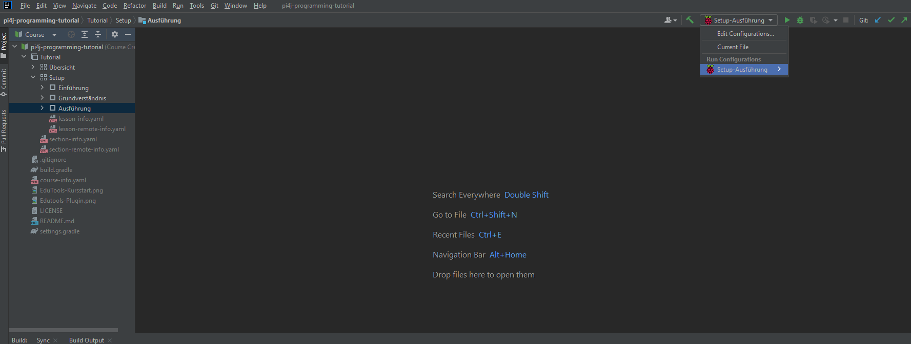

# Task 2/2: Ausführung
In diesem Task wird die Remote-Ausführung vorgestellt und getestet.

## Remote Ausführung
In diesem Task wurde eine Running-Config hinterlegt. Diese kann wie hier im Bild aufgezeigt ausgewählt werden:
 <!-- todo change picture to white -->

Mit der richtigen ausgewählten Running-Config, wie auf dem Bild gezeigt, kann das Programm gestartet werden. 
Die Applikation wird auf das Raspberry Pi geladen und automatisch ausgeführt. 
Folgende bekannte Probleme können auftraten:
- Benutzername und Passwort des Raspberry Pi stimmen nicht mit der Running-Config überein -> Pw auf Pi oder in Running-Config anpassen.
- Im gleichen Netzwerk gibt es mehr als ein Pi mit dem Namen Crowpi.local -> IP-Addresse anstelle von Namen in der Running-Config verwenden.

# Aufgabe

## Programmierung
Versuche, diese App auf dem Raspberry PI zum Laufen zu bringen.
Die Aufgabe ist erfüllt, wenn in der Konsole zuerst "Application is running" und nachher "Application is done" steht.

## Check Programmierung
Überprüfe die Programmierung mit dem *Check* Button unten links. Ist der Test 
erfolgreich, kannst du mit der Vorbereitung der Hardware beginnen. Ist der Test nicht 
erfolgreich, versuche den Fehler zu beheben. Nutze dazu allfällige Hints oder schau in 
der Lösung nach.

## Aufbau
Dieser Task erfordert keine Verdrahtung des Raspberry PI mit irgendwelchen Komponenten. Dieser Task ist nur zur Überprüfung, 
ob die Remote-Ausführung funktioniert auf dem definierten Setup.

## Remote Ausführung
Die Applikation ist nun bereit, um auf dem Pi ausgeführt zu werden. Dazu ist eine
Running-Config *Setup-Ausführung* hinterlegt. Diese kannst du nun auswählen und ausführen.