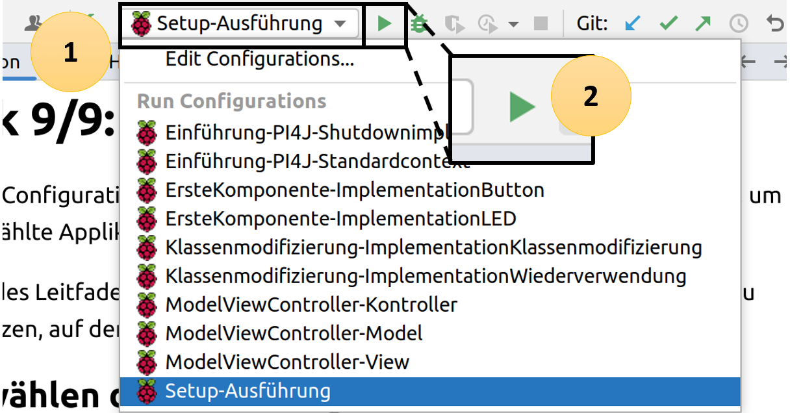
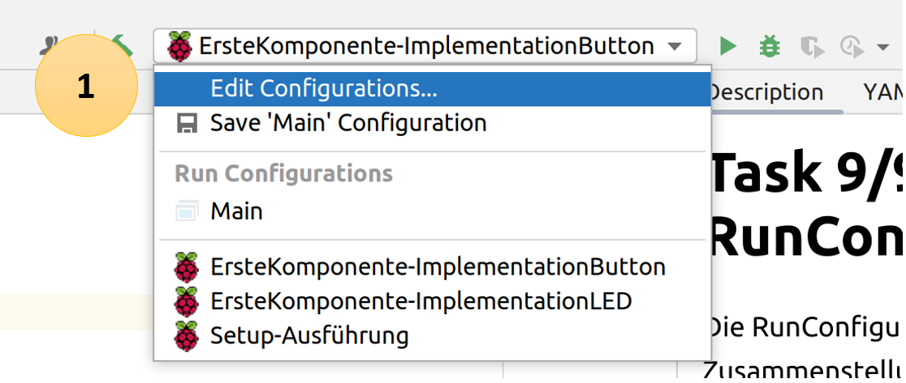

# Task 2/2: RunConfiguration
Die RunConfiguration ist eine Zusammenstellung von verschiedenen Befehlen, um eine ausgewählte Applikation auszuführen.

Im Fall des Leitfadens wird die RunConfiguration benutzt, um die Applikation zu übersetzen, auf dem Raspberry Pi
bereitzustellen und auszuführen.

## Auswählen der RunConfiguration
Um die Applikation auf dem Raspberry Pi auszuführen, muss die entsprechende RunConfiguration im Drop Down Menü (1)
ausgewählt und danach mit dem grünen Pfeil (2) gestartet werden.

---
> **_Resultat:_**
>
> Im Terminal sollen die zwei Zeilen **Application is running** und **Application is done** 
> sichtbar sein.
---

## Anpassen der RunConfiguration
Muss eine Konfiguration angepasst werden, weil zum Beispiel die IP-Adresse gewechselt werden muss, kann im Drop Down Menü
*Edit Configuration* angewählt werden

Es öffnet sich ein neues Fenster. Zuerst links im Fenster die entsprechende RunConfiguration auswählen. Danach lassen sich
die gewünschten Parameter editieren. Zum Beispiel kann anstelle des Hostname eine IP-Adresse vergeben werden.

Mit der richtigen ausgewählten Running-Config, kann das Programm gestartet werden.
Die Applikation wird auf das Raspberry Pi geladen und automatisch ausgeführt.
Folgende bekannte Probleme können auftreten:
- Benutzername und Passwort des Raspberry Pi stimmen nicht mit der Running-Config überein -> PW auf Pi oder in Running-Config anpassen.
- Im gleichen Netzwerk gibt es mehr als ein Pi mit dem Namen Crowpi.local -> IP-Adresse anstelle von Namen in der Running-Config verwenden.

Konnte die Applikation erfolgreich auf dem Raspberry Pi ausgeführt werden kann mit dem Button *Next* zum nächsten Task
gewechselt werden.